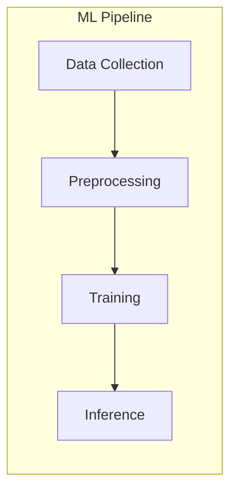

# 🌸 বাংলিশ (Banglish) to বাংলা (Bangla) Transformer
> *Where Technology Meets Tradition*

---

## 📖 The Story of Our Journey

In the heart of Bangladesh, where ancient scripts meet modern keystrokes, we crafted a bridge between convenience and heritage. Our application isn't just a translator; it's a cultural preservation tool, a teacher's companion, and a student's guide all woven into one digital tapestry.

### 🎯 The Vision
*Inspired by Rina's Story*

```
In a classroom in Dhaka, a teacher types her stories,
Her fingers dancing between two worlds:
The convenience of English keys,
And the beauty of Bangla expression.
```

---

## 🛠️ Architecture: The Two Pillars

### 1. The Soul: ML Translation Engine

Our translation engine stands on the shoulders of giants:

```python
# The Heart of Our System
model_name = "facebook/mbart-large-50-many-to-many-mmt"
# A bridge between worlds, one token at a time
```

**Key Components:**
- 🤓 mBART Architecture
  - Base: `mbart-large-50-many-to-many-mmt`
  - Specialization: Banglish → Bangla translation

**The Data Journey:**
```
Banglish Input → Tokenization → Neural Magic → Bengali Beauty
```

---

### 2. The Body: Application Features

#### 🖋️ Smart Text Editor
> *Where thoughts flow freely*
- Real-time Banglish-to-Bangla conversion
- Optical character recognition (OCR) for text extraction from images
- Seamless export to PDFs, automatically added to the user's dashboard

<div align="center">
  
</div>

#### 🎨 Content Gallery
> *A library of shared knowledge*

- **🌟 Manga Generator**
  - Dynamically creates storytelling manga from PDFs
  - Every document becomes a unique visual adventure

<div align="center">
  
</div>

- **🔠 Quiz Master**
  - Automatically generates quizzes from PDFs
  - Makes learning interactive and fun

<div align="center">
  
</div>

#### 🤖 Contextual Chatbot
> *Your Bengali language companion*
- PDF-aware conversations
- Retains context for meaningful interactions
- Supports multilingual queries

<div align="center">
  
</div>


#### 🗊 Dashboard
> *Your Personal Hub*
- Displays user statistics
- Lists all exported and generated PDFs
- Highlights user's contributions to the community
- Encourages engagement with personalized achievements and badges

---

## 💡 Behind the Scenes: Technical Mastery



### Training Pipeline Excellence
- Dataset: `SKNahin/bengali-transliteration-data`
- Optimizer: AdamW with learning rate warmup
- Validation: Robust split strategy
- Inference: Beam search with 5 beams for precise translations

---

## 🌟 Unique Features

- **Banglish OCR Integration:** Extract text from photos and instantly translate.
- **Manga Mode:** Transform documents into compelling visual stories.
- **Quiz Generator:** Promote active learning with automatically created quizzes.
- **Community Content Hub:** Explore, share, and learn with public PDFs and user-generated content.
- **Context-Aware Chatbot:** Engage in intelligent conversations, ask PDF-related queries, and more.

---

## 🚀 Future Horizons

Our journey is far from over. Here's a glimpse of what's next:

- 🔊 Voice Interaction:
  - Translate spoken Banglish into Bangla text in real time.

- 🔍 Enhanced Collaboration:
  - Real-time editing and annotations for teams.

- 🗺️ Cultural Preservation:
  - Integrate folklore, poems, and historical texts into the platform.

- 🔧 AI Fine-Tuning:
  - Continually improve translations with user feedback and advanced ML techniques.

---

## 🌸 Join Our Journey

*This isn't just a translation tool; it's a bridge between generations, a keeper of culture, and a window to the future of Bengali language preservation.*

```bengali
/* The code is poetry,
   The output is art,
   Together they preserve
   Our cultural heart */
```

---

*[Documentation crafted with 💕 for the Bengali language and its future]*

